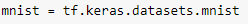
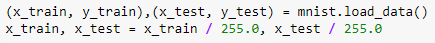
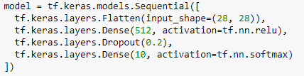
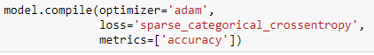
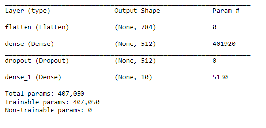
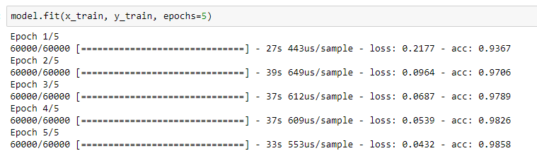
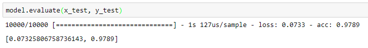

# Simple tensorflow model for MNIST

click this link to view the jupyter notebook incase error to open the jupyter notebook in GitHub LINK -> 
https://nbviewer.jupyter.org/github/Opapis/Tensorflow-study/blob/master/2%20-%20simple%20tensorflow%20model%20for%20mnist/Untitled.ipynb

Figure 1: Import MNIST Dataset
 

Figure 2: Split The Dataset
 

Figure 3: Model Used
 

Figure 4: Compiling The Model
 

Figure 5: Model Summary
 

Figure 6: Model Training
 

Figure 7: Evaluate Model Performance
 
